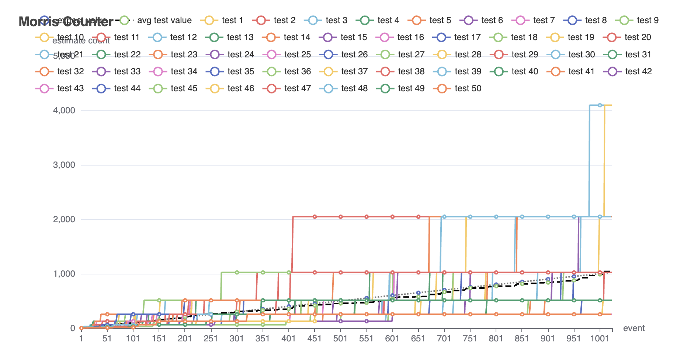

# Cardinality

Implement algorithms related to study of cardinality.

## Approximate Counting with Morris's Algorithm

Morris's Algorithm is an efficient probabilistic technique for approximating the count of a large number of events using a small amount of memory. This implementation provides a practical demonstration of the algorithm in the context of cardinality estimation.

### Study Resource: 
[Approximate Counting with Morris's Algorithm by Gregory Gundersen](https://gregorygundersen.com/blog/2019/11/11/morris-algorithm/#flajolet1985approximate)

[COMS W4995-3: Advanced Algorithms Lecture 1 – Counting, Morris’ Algorithm, Probability](https://www.cs.columbia.edu/~andoni/s17_advanced/algorithms/mainSpace/files/scribe1.pdf)

[Approximate Counting Morris Algorithm in Java by LEI ZHANG](https://coolbeevip.github.io/posts/algorithm/algorithm-morris-approximate-counter/)

### Features

- Efficient memory usage
- Probabilistic counting mechanism
- Suitable for high-volume data streams

### Test


```
localhost:8080/morris?testTime=[customize test time]&countPerTest=[customize count per test]
```

### Test Result

Test time: 50

Count per test: 1024


